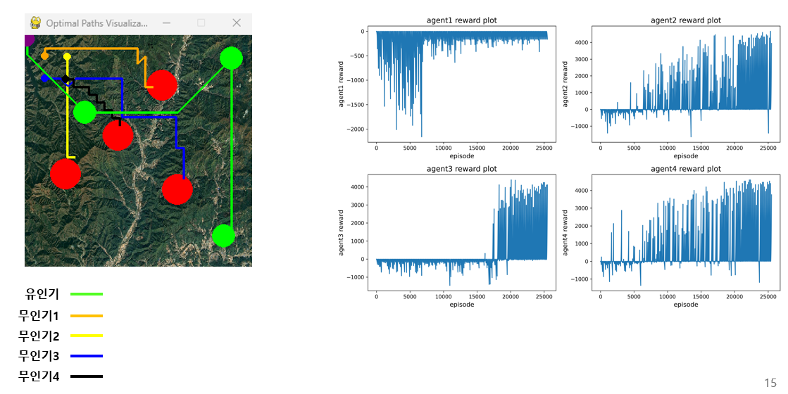

# mum-t(manned unmanned teaming) with reinforcement learning

### "Optimization of Operation Path for Manned-Unmanned Cooperative System Using Reinforcement Learning"
윤여건, 전세현

---

#### 공통 환경: 

###### 헬기 1대, 드론 4대 투입, 헬기는 3개의 목표 지점을 순서대로 도달

###### 장애물은 총 4개, 4개의 장애물 중 1개의 장애물은 무작위로 위치가 지정되어 기습 상황을 가정

#### 2D 환경:

##### 드론의 경로 탐색으로는 DDDQN 강화학습을 사용

#### 3D 환경:

##### 헬기의 이동경로는 다익스트라 알고리즘, 드론의 이동경로는 Q-러닝 강화학습을 이용

